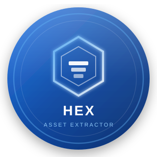

<p align="center">
  
</p>

<h1 align="center">HEX Asset Extractor Pro</h1>

<h3 align="center">Commercial-grade HTML Asset Intelligence</h3>

<p align="center">
  Extract • Inspect • Export embedded & external assets from HTML files<br/>
  <b>100% Client-Side • Free Forever</b>
</p>

<p align="center">
  <a href="https://bluhexh.github.io/hex-asset-extractor-pro/">
    
  </a>
  
  
  
</p>

---

**HEX Asset Extractor Pro** is a modern, responsive, browser-based web application that extracts Base64 and external assets from HTML files. Built as a clean SaaS-style dashboard — runs 100% client-side.

Perfect for portfolio showcases, static hosting, GitHub Pages, Netlify, and Vercel.

---

### ✨ Key Features

- **Drag & Drop Upload** — Instantly analyze any `.html` / `.htm` file
- **Base64 Extraction** — JPEG, PNG, GIF, SVG, WebP, Audio & Video
- **External Asset Detection** — Images, CSS, JS, Fonts, Videos & more
- **Smart Dashboard** — Live metrics, file size stats & duplicate rate
- **Asset Gallery** — Beautiful previews with detail modals
- **ZIP Export** — Download images or all assets with manifest
- **SHA-256 Duplicate Detection** — Accurate and fast
- **Professional Scan Report** — Clean, print-friendly layout
- **Premium UI** — Glassmorphism, smooth animations, fully responsive

---

### 🚀 Live Demo

👉 **[Try it now →](https://bluhexh.github.io/hex-asset-extractor-pro/)**

---

### 📦 Quick Start

```bash
git clone https://github.com/BluHExH/hex-asset-extractor-pro.git
cd hex-asset-extractor-pro
python3 -m http.server 8080
```

Then open: [http://localhost:8080](http://localhost:8080)

No build step required.

---

### 🧭 How to Use

1. Open the app in any modern browser
2. Drag & drop an HTML file **or** click **Load sample HTML**
3. Explore Dashboard → Gallery → Report
4. Download Images ZIP or All Assets ZIP
5. Print the professional scan report if needed

---

### 🛠 Tech Stack

| Technology | Purpose |
|---|---|
| HTML5 | Semantic structure |
| Tailwind CSS | Responsive styling |
| Custom CSS | Glassmorphism + polish |
| JavaScript ES6 Modules | Modular architecture |
| DOMParser API | HTML analysis |
| Web Crypto API | SHA-256 hashing |
| JSZip | Client-side ZIP generation |
| Browser File API | Secure local reading |

---

### 🔐 Security

All processing happens **locally** in your browser.  
No files are ever uploaded to any server.  
External assets are safely exported as URL references only.

---

### 🗺 Roadmap

- [ ] Dark mode
- [ ] PDF report export
- [ ] Batch HTML scanning
- [ ] Offline PWA support
- [ ] Advanced asset table view
- [ ] Local scan history

---

### 🤝 Contributing

1. Fork the repository
2. Create your feature branch
3. Commit your changes
4. Open a Pull Request

Please keep the design clean and professional.

---

### 📄 License

MIT License — see [LICENSE](LICENSE) for details.

---

<p align="center">
  <strong>Built by <a href="https://github.com/BluHExH">BluHExH</a></strong><br>
  If you find this useful, please ⭐ star the repository!
</p>